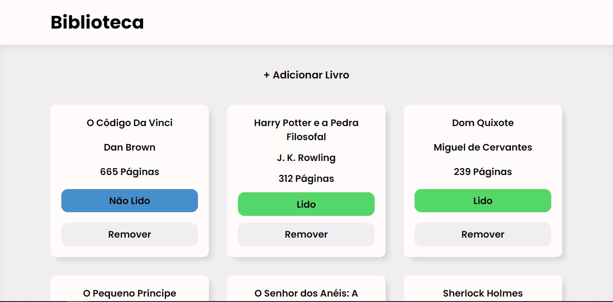

<h1 align="center"> Biblioteca </h1>

Aplicação para registrar as leituras do usuário.

  <a href="#-tecnologias">Tecnologias</a>&nbsp;&nbsp;&nbsp;|&nbsp;&nbsp;&nbsp;
  <a href="#-funcionalidades">Funcionalidades</a>&nbsp;&nbsp;&nbsp;|&nbsp;&nbsp;&nbsp;
  <a href="#memo-licença">Licença</a>

  

 

  

## 🚀 Tecnologias

Esse projeto foi desenvolvido com as seguintes tecnologias:

- HTML
- CSS
- JavaScript

## 💻 Funcionalidades

- Adicionar livros
- Remover livros
- Definir o livro como lido ou como não lido

## 📝 Licença

Esse projeto está sob a licença MIT.